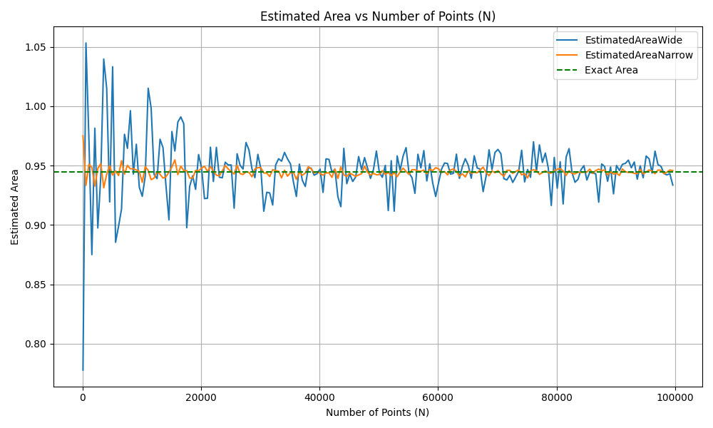
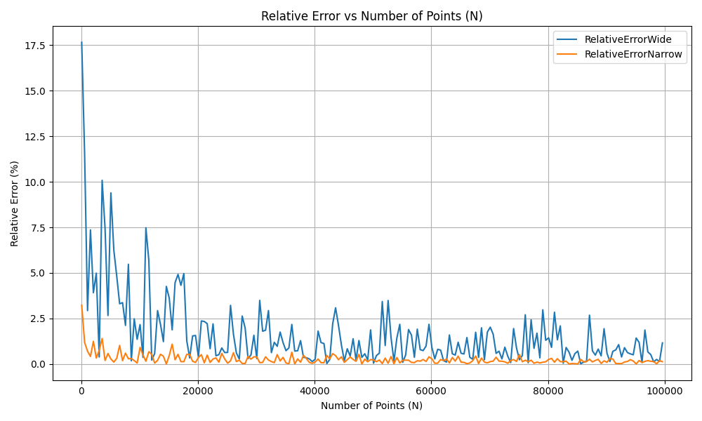

# IDZ_3_A1
Публичный репозиторий с исходными данными, полученными в результате экспериментальных замеров

Результаты (в формате csv), полученые в зависимости от масштаба прямоугольной области для случайной генерации точек, а также от количества случайно сгенерированных точек N, которое изменяется от 100 до 100000 с шагом 500 (графики под данными).

N,EstimatedAreaWide,RelativeErrorWide,EstimatedAreaNarrow,RelativeErrorNarrow
100,0.77777087639996633772,17.65413186639953124768,0.97500000000000019984,3.22734351006093866943
600,1.05323139512495456138,11.51002976425064971977,0.93333333333333357018,1.18408142626644741213
1100,0.97221359549995800542,2.93233516700059482218,0.95113636363636377968,0.70080013743706370821
1600,0.87499223594996211606,7.36089834969947354182,0.94843750000000026645,0.41506011315223456659
2100,0.98147277259995746590,3.91264312097201383267,0.93273809523809536604,1.24710178249970726760
2600,0.89742793430765355200,4.98553676892252717323,0.94759615384615403233,0.32598326347638445499
3100,0.94085186661286246412,0.38806274161234072251,0.95161290322580660561,0.75125338450943091040
3600,1.03972842852078839471,10.08041399804229953929,0.93125000000000013323,1.40465267308282792946
4100,1.01489614359507807073,7.45131573530793289706,0.94268292682926846382,0.19420070884664983324
4600,0.91937590009235148347,2.66181348337988410435,0.95000000000000017764,0.58048854826450224653
5100,1.03321523286466132596,9.39083462845946215225,0.94191176470588255931,0.27584688055198802736
5600,0.88540881018746164788,6.25805190148161205599,0.94553571428571447921,0.10783587651514070505
6100,0.89889912764258406153,4.82977535378962041790,0.94159836065573787600,0.30902828315889019350
6600,0.91329155940905137889,3.30598817645399511989,0.95416666666666682950,1.02163104189723963344
7100,0.97632154026967610250,3.36726052686115640000,0.94278169014084522992,0.18374422239503340748
7600,0.96453822500916874816,2.11971146831373546959,0.95016447368421064201,0.59790206774999843375
8100,0.99621886946291993148,5.47387430692653520481,0.94722222222222240973,0.28639355250934395158
8600,0.94282109144995929206,0.17957264037384018662,0.94738372093023270892,0.30349209877417487879
9100,0.96794012914611193832,2.47988534209069166891,0.94629120879120898202,0.18782325173426342446
9600,0.93170469568745972744,1.35651213162443307070,0.94505208333333345916,0.05663183707561920271
10100,0.92408420958411852109,2.16332498978161114067,0.93589108910891105619,0.91328108364041715728
10600,0.94102938583297823794,0.36926803646923395119,0.94917452830188697721,0.49309239386556413809
11100,1.01513113259860476845,7.47619500770602307682,0.94594594594594616499,0.15126882472994976347
11600,0.99819516572452582359,5.68311308956698724160,0.93814655172413807804,0.67448578707001705101
12100,0.94248475001772791249,0.21518251992421402741,0.93946280991735553467,0.53512800588110365219
12600,0.93903487755829273542,0.58043500139704862217,0.94503968253968273494,0.05531891298743387558
13100,0.97221359549995800542,2.93233516700059482218,0.94265267175572531322,0.19740394050773799051
13600,0.96506496612128178647,2.17547976136087806154,0.93943014705882377235,0.53858615984795377152
14100,0.93291134376698092723,1.22875923336752013171,0.94051418439716338860,0.42381457553768120405
14600,0.90429182375954997308,4.25882797480355712594,0.94452054794520567960,0.00035595389816293861
15100,0.97865209613240800035,3.61400626082178444420,0.94892384105960281282,0.46655108302160791522
15600,0.96224217400765077457,1.87661890887751492407,0.95480769230769246825,1.08949911784073760757
16100,0.98670622052604428642,4.46673022539066000292,0.94231366459627352583,0.23329605179091711387
16600,0.99095506240116204566,4.91657295335241695255,0.94954819277108448716,0.53265382003926253773
17100,0.98529015263241359612,4.31680517217077941439,0.94576023391812891195,0.13160671263821482890
17600,0.89764039357240432704,4.96304281455911855403,0.94573863636363653118,0.12932008886738174946
18100,0.93246563634692103406,1.27594814921932075968,0.93950276243093933104,0.53089806552848328725
18600,0.94137456209431413789,0.33272277646878317681,0.93944892473118302156,0.53659808883775106381
19100,0.92996557014577130307,1.54064065439262964929,0.94594240837696352830,0.15089428744937419258
19600,0.95931688453924424120,1.56690623111180737936,0.94534438775510232222,0.08757933344017730659
20100,0.94802917770145156418,0.37182931707520416875,0.94788557213930368928,0.35662519328669745056
20600,0.92218707068296978946,2.36418305033051279196,0.94939320388349535129,0.51624449579371800567
21100,0.92245100388195067076,2.33623933443829878698,0.94514218009478700999,0.06617075947942403780
21600,0.96546211219787481106,2.21752728389640729745,0.94913194444444459741,0.48858386209101228870
22100,0.93658042752009529330,0.84029793188042245511,0.94536199095022643846,0.08944305761448682890
22600,0.96533066739022377334,2.20361067024306667150,0.94192477876106217582,0.27446902789097760156
23100,0.94022734733632296056,0.45418321944618483821,0.94134199134199159076,0.33617117876455820946
23600,0.93966915734551026418,0.51328113731849245305,0.94549788135593249017,0.10383034539863054968
24100,0.95285000521614138247,0.88223056616406481112,0.95005186721991730092,0.58597994860019120278
24600,0.95047711267373935495,0.63100247017740229705,0.94715447154471554825,0.27922050383237967397
25100,0.95052277424577558129,0.63583685251770283298,0.94497011952191256601,0.04795398423773367114
25600,0.91410864233140576296,3.21948017696468191673,0.94287109375000011102,0.17427868693526915589
26100,0.95992123969478604373,1.63089184879713045007,0.95038314176245231035,0.62105337526521653402
26600,0.95028396552627469873,0.61055317075245618685,0.94323308270676720078,0.13595339628188971015
27100,0.94710106720291109550,0.27356636194891614799,0.94252767527675296311,0.21063784253073994379
27600,0.96939558507821887989,2.63398057231362381359,0.94479166666666691832,0.02906043122358633810
28100,0.96321802486543883770,1.97993633627390064333,0.94426156583629905494,0.02706356930087721463
28600,0.94739835337705691209,0.30504129735336948936,0.94055944055944074034,0.41902311563065425259
29100,0.93980647564995933863,0.49874267189943227718,0.94703608247422688127,0.26668615588656385818
29600,0.95940402447816797160,1.57613210230024392011,0.94826858108108125212,0.39717595800495120173
30100,0.94734301514995911120,0.29918240691453618085,0.94821428571428589827,0.39142747956475759663
30600,0.91152967499652914896,3.49252627642984547762,0.94379084967320281407,0.07690026577643979677
31100,0.92751052663934896447,1.80056641784863313838,0.94368971061093265273,0.08760828292848839294
31600,0.92698720355739661070,1.85597282969216070825,0.94078322784810142210,0.39532981581551446260
32100,0.91678833444809126885,2.93576992195924946216,0.94657320872274164358,0.21767976845440262235
32600,0.95044316836146192085,0.62740864332235068979,0.94578220858895722944,0.13393326329884583381
33100,0.95576526880871992553,1.19088176236250542495,0.94524169184290052215,0.07670648604947549742
33600,0.95369524129995875139,0.97171925905772049692,0.93962053571428594267,0.51842891355276177201
34100,0.96109443707635144882,1.75510318121964958848,0.94611436950146643454,0.16910053367443866890
34600,0.95563538679056558856,1.17713060779450784388,0.94107658959537587862,0.36427037596052774804
35100,0.95143980072431777462,0.73292629591082736340,0.94398148148148164349,0.05671727587167794959
35600,0.93616522622861120251,0.88425703582078063469,0.94431179775280915667,0.02174530540266493561
36100,0.92400688259289631699,2.17151192299750217529,0.93840027700831041280,0.64762282597622689018
36600,0.95122865723643434954,0.71057164836861752555,0.94443306010928973482,0.00890675060547508821
37100,0.93762270746599718496,0.72994737802476883370,0.94188005390835594088,0.27920423582302211774
37600,0.93239420887575752417,1.28351047547762897594,0.94358377659574488305,0.09882396187739907190
38100,0.94797204915547073067,0.36578087805962083978,0.94898293963254609640,0.47280809706280862992
38600,0.94778232120889682744,0.34569358378839742940,0.94734455958549235177,0.29934592278870952864
39100,0.94187854213653221525,0.27936429345313140704,0.94367007672634284354,0.08968700472232339627
39600,0.94324359442192895475,0.13484047686457453774,0.94488636363636380189,0.03908639698795765560
40100,0.94699907830993412805,0.26276836965194766416,0.94348503740648392846,0.10927789439816368300
40600,0.92743429935254606544,1.80863692074057436088,0.94190270935960607179,0.27680560808089627045
41100,0.95565521309484924295,1.17922970186919884306,0.94382603406326059936,0.07317514668035059178
41600,0.95515311654046353151,1.12607063161813014673,0.94384014423076945111,0.07168124400504727323
42100,0.94427111448915168612,0.02605261333361887435,0.94005344418052272371,0.47259507667826150534
42600,0.94688126942002948105,0.25029544786043389504,0.94718309859154947716,0.28225136947053819370
43100,0.92371570152490201089,2.20234048518157887742,0.93912412993039462439,0.57098547803904908804
43600,0.91535247924938700770,3.08778994024371256089,0.94888188073394519328,0.46210856717498932644
44100,0.96449761458329152930,2.11541187202438418780,0.94229024943310679685,0.23577511342328230648
44600,0.93472015639099093054,1.03725264661468408178,0.94077914798206296876,0.39576176836220816613
45100,0.94289628973765327036,0.17161108193778409903,0.94368070953436833381,0.08856126469511947652
45600,0.93660840461213057395,0.83733587968561373760,0.94224232456140366576,0.24084912080171791415
46100,0.94036885517013280023,0.43920119096407927994,0.94086225596529293735,0.38696277725112271373
46600,0.95760952861476544840,1.38614129110143813328,0.94211373390557950902,0.25446355341807103123
47100,0.94661816326174252900,0.22243929423879318930,0.94312632696390674703,0.14725607498950796237
47600,0.95669085742054682520,1.28887771475435752855,0.94957983193277328837,0.53600359092338578648
48100,0.94795878646461606554,0.36437670129580307377,0.94449064449064468185,0.00281005038502230454
48600,0.93920634380088530158,0.56228115039757964322,0.94197530864197553946,0.26911921725039683606
49100,0.94667071284832970957,0.22800293959873840777,0.94335539714867633343,0.12300345278322773190
49600,0.96221704441719624334,1.87395833363021524498,0.94221270161290338052,0.24398542673055872987
50100,0.94407567706732442581,0.04674439372098633527,0.94244011976047914469,0.21990771263802011415
50600,0.94012670410697518619,0.46483874068499975163,0.94572628458498042558,0.12801235420246476204
51100,0.95014377611091782594,0.59571072876730912782,0.94244129158512746081,0.21978364664263011496
51600,0.91210969298746058520,3.43111733654072326161,0.94428294573643423160,0.02479998951065703547
52100,0.95411288172577446431,1.01593660439040411880,0.94145873320537454276,0.32381122755077712538
52600,0.91158886939273631178,3.48625911717738734552,0.94410646387832719562,0.04348486478256352594
53100,0.95811558290984566444,1.43971938397629672934,0.94063088512241077588,0.41145897979102963316
53600,0.94609442427757095562,0.16698884908116309878,0.94465951492537325596,0.01506897153745958250
54100,0.95801676111095679378,1.42925670522739056700,0.94789741219963052909,0.35787875018366005486
54600,0.96509115157688130093,2.17825212548409741231,0.94510073260073268475,0.06178253926775527372
55100,0.94362945712046730762,0.09398757293663850820,0.94255898366606183369,0.20732309190721839864
55600,0.93986476183673994811,0.49257166859205425702,0.94651528776978433033,0.21154743398532094290
56100,0.92663566758258020251,1.89319141925987088904,0.94650178253119443550,0.21011757767444458334
56600,0.95950267570013525464,1.58657672135429961280,0.94536219081272110376,0.08946421789591409157
57100,0.94803595442097476909,0.37254679682299213228,0.94524956217162892091,0.07753975079530474324
57600,0.96259273179448967550,1.91373393357715171348,0.94622395833333350357,0.18070316340983175185
58100,0.93707334506020045772,0.78811068240906856364,0.94302925989672992113,0.15753297292486834191
58600,0.95147525088605100496,0.73667955337003099281,0.94686433447098983240,0.24850247370469935593
59100,0.93520038754945189474,0.98640855763141788159,0.94583333333333352577,0.13934605463176480411
59600,0.92392916189794660475,2.17974053927997868385,0.94823825503355718691,0.39396521203052137228
60100,0.93597801390395285459,0.90407799063803639950,0.94721297836938445069,0.28541486699933327209
60600,0.94718631482372139807,0.28259188547383973233,0.94412128712871301595,0.04191546502921714851
61100,0.95216467356329759220,0.80967162673183534771,0.94498772504091665958,0.04981795445097313146
61600,0.95169610078973154721,0.76006185990479513404,0.94216720779220797244,0.24880204853210746707
62100,0.94278104220623948351,0.18381282195207898633,0.94631642512077318585,0.19049301041527572087
62600,0.94348204355626907880,0.10959486589000566603,0.94710463258785959617,0.27394384422258227785
63100,0.95957944101010117510,1.59470418701738481104,0.94510697305863733408,0.06244324274650737971
63600,0.93919502055844994448,0.56347998961452550049,0.94113600628930837999,0.35797968111457645346
64100,0.94915954456142548334,0.49150600235409308558,0.94299921996879898511,0.16071342621670853257
64600,0.95580937229415363632,1.19555118353261469188,0.94042182662538720272,0.43359288059713158026
65100,0.95011104371286214665,0.59224521235910232431,0.94546850998463916049,0.10072067500492996872
65600,0.93931246467663620514,0.55104568773632112144,0.94365472560975627303,0.09131229188657458140
66100,0.95824078285661518084,1.45297482798923849323,0.94438350983358565482,0.01415284632970410621
66600,0.94798124462113009248,0.36675444061588124978,0.94395645645645664956,0.05936678033793735265
67100,0.94700269153319305282,0.26315091676838620049,0.94623695976155020038,0.18207967920126388872
67600,0.92806129168065509827,1.74225461055402686128,0.94866863905325471418,0.43953177515109309592
68100,0.94109133943255851573,0.36270874877122560864,0.94425477239353905468,0.02778281960795668526
68600,0.96328510329638683540,1.98703821138526981471,0.94141763848396509129,0.32816209824142711371
69100,0.94674750855560296792,0.23613362355237402235,0.94551374819102773639,0.10551023384662490401
69600,0.96103872658616529279,1.74920487772471577870,0.94389367816091973573,0.06601338205933748871
70100,0.96361484472663450074,2.02194932101570490346,0.94577389443651949108,0.13305300907352743400
70600,0.95995764507510017438,1.63474623925795214952,0.94300637393767727801,0.15995600549582666972
71100,0.93898604223603532315,0.58560540199816701890,0.94099859353023929120,0.37252814684082269370
71600,0.93786023800533657724,0.70479902255962267876,0.94601955307262586281,0.15906192026897925107
72100,0.94187405888588171532,0.27983895402230152261,0.94596047156726792426,0.15280671324469674577
72600,0.93578906409830664437,0.92408289986224201318,0.94338842975206638197,0.11950615237586757755
73100,0.94042713184407689120,0.43303119482064289514,0.94493844049247621708,0.04459999238779385755
73600,0.94526637084207876249,0.07931935530655931377,0.94633152173913070992,0.19209135278351407994
74100,0.96289818857951292586,1.94607392585927874151,0.94218960863697720498,0.24643037704707246305
74600,0.93624429893722493912,0.87588527617530242964,0.94319705093833794418,0.13976823088386081118
75100,0.94671078880042514037,0.23224594890483871157,0.93958055925432770739,0.52266138920858229433
75600,0.94006367501384824337,0.47151189540022298008,0.94568452380952394698,0.12359096557344687040
76100,0.97004176486612103680,2.70239433942647977460,0.94648488830486210421,0.20832891500270686591
76600,0.94517945766164312982,0.07011749199129678478,0.94572454308094011655,0.12782797385806154988
77100,0.96742188128089201538,2.42501626475078113643,0.94254215304798982800,0.20910502010537795892
77600,0.95266909538423716342,0.86307688271552718273,0.94410438144329911214,0.04370534092203158527
78100,0.96051217706500324756,1.69345686921594418273,0.94551856594110128551,0.10602030927409963890
78600,0.94772271866675295016,0.33938321241202934475,0.94395674300254472922,0.05933644250053667080
79100,0.91641271403889834612,2.97553843171222132113,0.94356826801517079684,0.10046592041511666349
79600,0.95682428481742087811,1.30300423345258442609,0.94568153266331667073,0.12327428036623938601
80100,0.93094610205801220371,1.43682762410804687470,0.94687890137328356577,0.25004473280926620138
80600,0.95315531409933840212,0.91455489945888712722,0.94742555831265529154,0.30792159810432639944
81100,0.91766893631962742628,2.84253690463754127293,0.94545314426633808580,0.09909384189585933311
81600,0.95708232998176012707,1.33032455839654084606,0.94174325980392181723,0.29368720198566050650
82100,0.96427957468406311214,2.09232707245869109514,0.94573690621193684525,0.12913691044294275945
82600,0.94408295998851843311,0.04597332027703711355,0.94328087167070240326,0.13089377802944965334
83100,0.93594569963894869158,0.90749923754455918967,0.94302045728038519368,0.15846494287482162933
83600,0.93837218924511500706,0.65059659539140779483,0.94449760765550261343,0.00207283088686139368
84100,0.94643432893676049389,0.20297598242970527060,0.94424791914387651293,0.02850840192290582040
84600,0.94991933574499431980,0.57194828492042748547,0.94434101654846358542,0.01865178883243930399
85100,0.93782625211035897106,0.70839725194972547051,0.94455052878965939378,0.00353015177420935768
85600,0.94438738861941007308,0.01374218298949981924,0.94694801401869177493,0.25736197874613009340
86100,0.94353272984873970408,0.10422849530116806704,0.94339430894308962117,0.11888369773861919010
86600,0.94313699951445117975,0.14612612725496576527,0.94579965357967688000,0.13578023770863784092
87100,0.91919391032630926031,2.68108150398968536621,0.94701492537313447517,0.26444616476641730207
87600,0.95134873751434234634,0.72328505154440447811,0.94560502283105030141,0.11517386319982127196
88100,0.94914973154314852266,0.49046705690943021017,0.94636776390465393582,0.19592846300917002300
88600,0.93677059421931607730,0.82016418502438315219,0.94207110609480826380,0.25897673871608656304
89100,0.94875389594524517367,0.44855828025478466925,0.94483726150392832732,0.03388774807309279102
89600,0.92620705928433488818,1.93856997929498020561,0.94285714285714306016,0.17575572653447618654
90100,0.95009330836594119152,0.59036749671922583715,0.94363207547169836165,0.09371035709873286323
90600,0.94581574290691272644,0.13748368233368449265,0.94169426048565141318,0.29887496553320697101
91100,0.95108315731016745964,0.69516696029739610818,0.94711855104281028606,0.27541744948445323615
91600,0.95183531926240416698,0.77480150411148496215,0.94480076419213998573,0.03002362444112465639
92100,0.95458496678676652003,1.06591823183347589321,0.94427252985884924108,0.02590276220134888827
92600,0.94817073228511017380,0.38681629516007698388,0.94431695464362863657,0.02119932372054562225
93100,0.95299906257063549120,0.89801189409746406955,0.94346133190118175449,0.11178769577140171276
93600,0.93856004796342107355,0.63070720416480252624,0.94320245726495743899,0.13919584038634474910
94100,0.94979379207556990927,0.55865644954690218960,0.94679861849096713655,0.24154484699300382555
94600,0.93973796165450473872,0.50599653625229257248,0.94295718816067675139,0.16516351021197295257
95100,0.95800353348371258821,1.42785624079522577290,0.94457150368033671040,0.00575085151270508799
95600,0.95573884628751093473,1.18808429910789792316,0.94631276150627641197,0.19010512816691990667
96100,0.94368453889943881840,0.08815583373762579666,0.94530437044745085906,0.08334253306757692659
96600,0.96214927256517579490,1.86678304311859677433,0.94312888198757771629,0.14698556390626746349
97100,0.95078684890500519966,0.66379554540036744825,0.94626673532440797043,0.18523214305287871717
97600,0.94940243634324794630,0.51722197506994760374,0.94592725409836087014,0.14928984034889852817
98100,0.94337423196372072187,0.12100933183703743712,0.94320846075433251166,0.13856022576072463126
98600,0.94214005121725130643,0.25167722913888534997,0.94442190669371206546,0.01008760953998436016
99100,0.94317472322266349138,0.14213215988460103922,0.94627901109989920325,0.18653183094363345873
99600,0.93355932001622465854,1.16015526735003948744,0.94575803212851417001,0.13137359992755034965

График отображающий, как меняется приближенное значение площади в зависимости от рассматриваемой области (прямоугольная область (wide), которая охватывает все три круга полностью, и узкая прямоугольная область (narrow), которая более плотно ограничивает пересечение трех кругов) и кол-во сгенерированных точек в рассматриваемой прямоугольной области (100 <= N < 100000 c шагом 500):

График отображающий, как меняется величина относительного отклонения приближенного значения площади от ее точной оценки в зависимости от рассматриваемой области (прямоугольная область (wide), которая охватывает все три круга полностью, и узкая прямоугольная область (narrow), которая более плотно ограничивает пересечение трех кругов) и кол-во сгенерированных точек в рассматриваемой прямоугольной области (100 <= N < 100000 c шагом 500):

